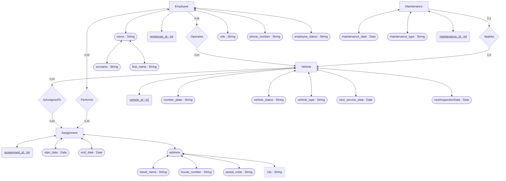
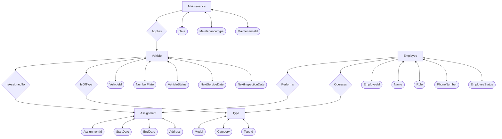

ER Diagram  

```mermaid  
flowchart TB

Maintenance[Maintenance] --> |1,1|Applies{Applies} 
Applies{Applies} --> |1,n|Vehicle[Vehicle]

Employee[Employee] --> |n,m|Performs{Performs} 
Performs{Performs} --> |n,m|Assignment[Assignment]

Vehicle[Vehicle] --> |n,m|IsAssignedTo{IsAssignedTo}
IsAssignedTo{IsAssignedTo} --> |n,m|Assignment[Assignment]

Employee[Employee] --> |n,m|Operates{Operates} 
Operates{Operates} --> |n,m|Vehicle[Vehicle]

Vehicle[Vehicle] <--> vehicle_id("<u>vehicle_id : Int</u>")
Vehicle[Vehicle] <--> number_plate([number_plate : String])

Vehicle[Vehicle] <--> vehicle_status([vehicle_status : String])
Vehicle[Vehicle] <--> vehicle_type([vehicle_type : String])
Vehicle[Vehicle] <--> next_service_date([next_service_date : Date])
Vehicle[Vehicle] <--> nextInspectionDate([nextInspectionDate : Date])

Employee[Employee] --> employee_id("<u>employee_id : Int</u>")
Employee[Employee] <--> name([name : String])
name([name : String]) <--> surname([surname : String])
name([name : String]) <--> first_name([first_name : String])
Employee[Employee] <--> role([role : String])
Employee[Employee] <--> phone_number([phone_number : String]) 
Employee[Employee] <--> employee_status([employee_status : String]) 

Assignment[Assignment] <--> assignment_id("<u>assignment_id : Int</u>") 
Assignment[Assignment] <--> start_date([start_date : Date])
Assignment[Assignment] <--> end_date([end_date : Date])

Assignment[Assignment] <--> address([address : String])
address([address]) <--> street_name([street_name : String])
address([address]) <--> house_number([house_number : String])
address([address]) <--> postal_code([postal_code : String])
address([address]) <--> city(city : String)
style city stroke-dasharray: 5 5

Maintenance[Maintenance] <--> maintenance_date([maintenance_date : Date])
Maintenance[Maintenance] <--> maintenance_type([maintenance_type : String])
Maintenance[Maintenance] <--> maintenance_id("<u>maintenance_id : Int</u>")

```

Gammel version: 

```mermaid  
flowchart TB

Maintenance[Maintenance] --> Applies{Applies} 
Applies{Applies} --> Vehicle[Vehicle]

Employee[Employee] --> Performs{Performs} 
Performs{Performs} --> Assignment[Assignment]

Vehicle[Vehicle] --> IsAssignedTo{IsAssignedTo}
IsAssignedTo{IsAssignedTo} --> Assignment[Assignment]

Employee[Employee] --> Operates{Operates} 
Operates{Operates} --> Type[Type]

Vehicle[Vehicle] --> IsOfType{IsOfType} 
IsOfType{IsOfType} --> Type[Type]

Vehicle[Vehicle] <--> VehicleId([VehicleId])
Vehicle[Vehicle] <--> NumberPlate([NumberPlate])

Vehicle[Vehicle] <--> VehicleStatus([VehicleStatus])
Vehicle[Vehicle] <--> NextServiceDate([NextServiceDate])
Vehicle[Vehicle] <--> NextInspectionDate([NextInspectionDate])

Employee[Employee] --> EmployeeId([EmployeeId])
Employee[Employee] <--> Name([Name])
Employee[Employee] <--> Role([Role])
Employee[Employee] <--> PhoneNumber([PhoneNumber]) 
Employee[Employee] <--> EmployeeStatus([EmployeeStatus]) 
Assignment[Assignment] <--> AssignmentId([AssignmentId])
Assignment[Assignment] <--> StartDate([StartDate])
Assignment[Assignment] <--> EndDate([EndDate])
Assignment[Assignment] <--> Address([Address])
Maintenance[Maintenance] <--> Date([Date])
Maintenance[Maintenance] <--> MaintenanceType([MaintenanceType])
Maintenance[Maintenance] <--> MaintenanceId([MaintenanceId])
Type[Type] <--> Model([Model])
Type[Type] <--> Category([Category])
Type[Type] <--> TypeId([TypeId])


```

