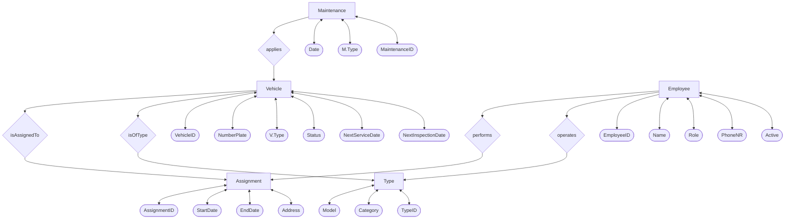

ER Diagram 

```mermaid  
flowchart TB

Maintenance[Maintenance] --> applies{applies} 
applies{applies} --> Vehicle[Vehicle]

Employee[Employee] --> performs{performs} 
performs{performs} --> Assignment[Assignment]

Vehicle[Vehicle] --> isAssignedTo{isAssignedTo}
isAssignedTo{isAssignedTo} --> Assignment[Assignment]

Employee[Employee] --> operates{operates} 
operates{operates} --> Type[Type]

Vehicle[Vehicle] --> isOfType{isOfType} 
isOfType{isOfType} --> Type[Type]

Vehicle[Vehicle] <--> VehicleID([VehicleID])
Vehicle[Vehicle] <--> NumberPlate([NumberPlate])
Vehicle[Vehicle] <--> V.Type([V.Type])
Vehicle[Vehicle] <--> Status([Status])
Vehicle[Vehicle] <--> NextServiceDate([NextServiceDate])
Vehicle[Vehicle] <--> NextInspectionDate([NextInspectionDate])

Employee[Employee] --> EmployeeID([EmployeeID])
Employee[Employee] <--> Name([Name])
Employee[Employee] <--> Role([Role])
Employee[Employee] <--> PhoneNR([PhoneNR]) 
Employee[Employee] <--> Active([Active]) 
Assignment[Assignment] <--> AssignmentID([AssignmentID])
Assignment[Assignment] <--> StartDate([StartDate])
Assignment[Assignment] <--> EndDate([EndDate])
Assignment[Assignment] <--> Address([Address])
Maintenance[Maintenance] <--> Date([Date])
Maintenance[Maintenance] <--> M.Type([M.Type])
Maintenance[Maintenance] <--> MaintenanceID([MaintenanceID])
Type[Type] <--> Model([Model])
Type[Type] <--> Category([Category])
Type[Type] <--> TypeID([TypeID])


```

