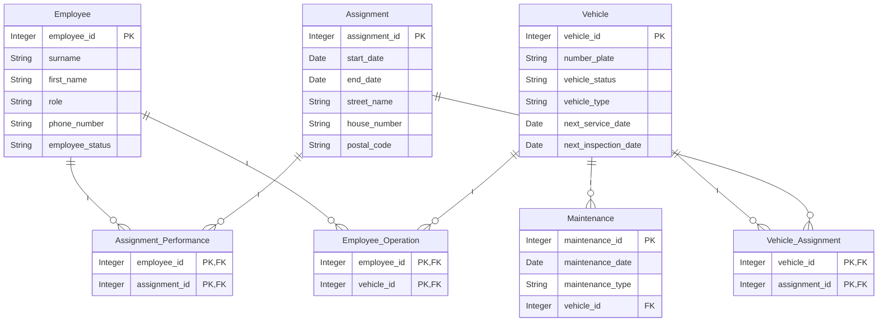

ER Diagram 

```mermaid
erDiagram

Employee{
Integer employee_id PK
String surname 
String first_name
String role
String phone_number
String employee_status
}

Vehicle{
Integer vehicle_id PK
String number_plate
String vehicle_status
String vehicle_type
Date next_service_date
Date next_inspection_date
}

Assignment{
Integer assignment_id PK
Date start_date
Date end_date
String street_name
String house_number
String postal_code
}

Maintenance{
Integer maintenance_id PK
Date maintenance_date
String maintenance_type
Integer vehicle_id FK 
}

Assignment_Performance{
Integer employee_id PK, FK
Integer assignment_id PK, FK
}

Vehicle_Assignment{
Integer vehicle_id PK, FK
Integer assignment_id PK, FK
}

Employee_Operation{
Integer employee_id PK, FK
Integer vehicle_id PK, FK
}

Vehicle ||--o{ Maintenance : I
Employee ||--o{ Assignment_Performance : I
Assignment ||--o{ Assignment_Performance : I
Vehicle ||--o{ Vehicle_Assignment : I
Assignment ||--o{ Vehicle_Assignment : I
Employee ||--o{ Employee_Operation : I
Vehicle ||--o{ Employee_Operation : I


```

