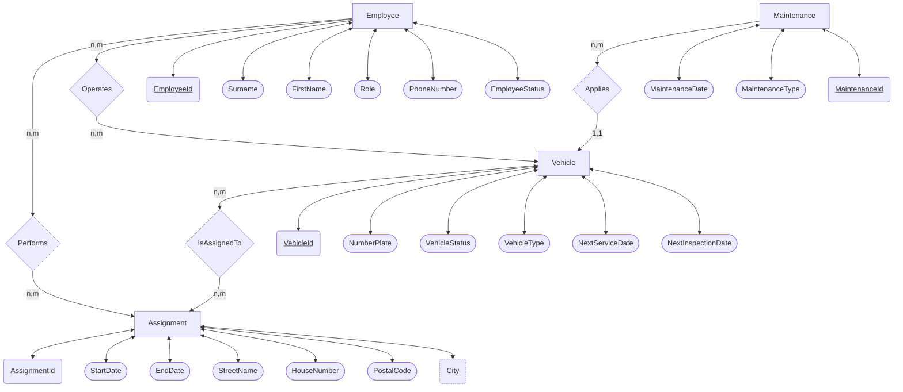

ER Diagram 


```mermaid
erDiagram


```



```mermaid  
flowchart TB

Maintenance[Maintenance] --> |n,m|Applies{Applies} 
Applies{Applies} --> |1,1|Vehicle[Vehicle]

Employee[Employee] --> |n,m|Performs{Performs} 
Performs{Performs} --> |n,m|Assignment[Assignment]

Vehicle[Vehicle] --> |n,m|IsAssignedTo{IsAssignedTo}
IsAssignedTo{IsAssignedTo} --> |n,m|Assignment[Assignment]

Employee[Employee] --> |n,m|Operates{Operates} 
Operates{Operates} --> |n,m|Vehicle[Vehicle]

Vehicle[Vehicle] <--> VehicleId("<u>VehicleId</u>")
Vehicle[Vehicle] <--> NumberPlate([NumberPlate])

Vehicle[Vehicle] <--> VehicleStatus([VehicleStatus])
Vehicle[Vehicle] <--> VehicleType([VehicleType])
Vehicle[Vehicle] <--> NextServiceDate([NextServiceDate])
Vehicle[Vehicle] <--> NextInspectionDate([NextInspectionDate])

Employee[Employee] --> EmployeeId("<u>EmployeeId</u>")
Employee[Employee] <--> Surname([Surname])
Employee[Employee] <--> FirstName([FirstName])
Employee[Employee] <--> Role([Role])
Employee[Employee] <--> PhoneNumber([PhoneNumber]) 
Employee[Employee] <--> EmployeeStatus([EmployeeStatus]) 

Assignment[Assignment] <--> AssignmentId("<u>AssignmentId</u>") 
Assignment[Assignment] <--> StartDate([StartDate])
Assignment[Assignment] <--> EndDate([EndDate])


Assignment[Assignment] <--> StreetName([StreetName])
Assignment[Assignment] <--> HouseNumber([HouseNumber])
Assignment[Assignment] <--> PostalCode([PostalCode])
Assignment[Assignment] <--> City(City)
style City stroke-dasharray: 2


Maintenance[Maintenance] <--> MaintenanceDate([MaintenanceDate])
Maintenance[Maintenance] <--> MaintenanceType([MaintenanceType])
Maintenance[Maintenance] <--> MaintenanceId("<u>MaintenanceId</u>")

```
```


